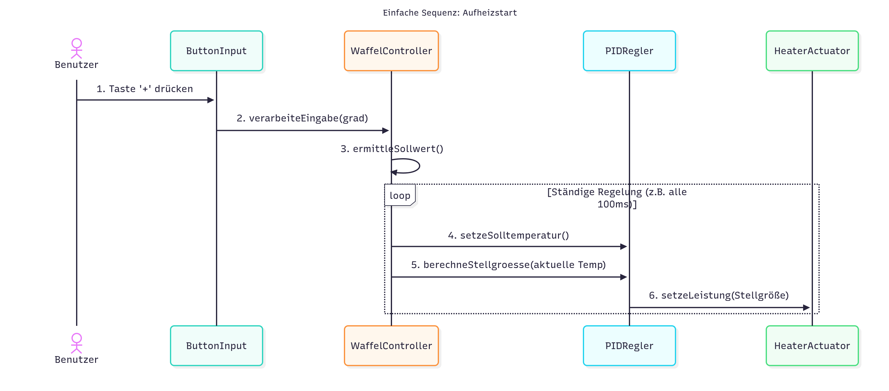

# Design

## Klassendiagramm

Das vorliegende Klassendiagramm wurde nach einer ersten Ideenfindung erstellt und stellt die finale Struktur der Klassen für die Implementierung im **Sprint 1** dar. Es konzentriert sich primär auf die **geschlossene Regelschleife** (Temperaturmessung und Heizleistungsregelung), welche die Kernfunktionalität des Waffeleisens bildet.

Das Diagramm enthält alle **Methoden** und **Attribute** (sowohl `public` als auch `private`), um die interne Struktur des Codes sowie die Interaktion zwischen den Klassen klar ersichtlich zu machen. Die Sichtbarkeit der Attribute (interner Zustand) und Methoden (öffentliche Schnittstelle) ist entsprechend der UML-Konventionen angegeben.

- [ref. code in mermaid](../referenziert/design/diagram_1.mmd)
- [ref. image in PNG](../referenziert/design/diagram_1.png)

## Sequenzdiagramm

- [ref. code in mermaid](../referenziert/design/Sequenzdiagramm1.mmd)
- [ref. image in PNG](../referenziert/design/Sequenzdiagramm1.png)

## Kommunikationsdiagramm

- [ref. code in mermaid](../referenziert/design/Kommunikationsdiagramm.mmd)
- [ref. image in PNG](../referenziert/design/Kommunikationsdiagramm.1.png)

