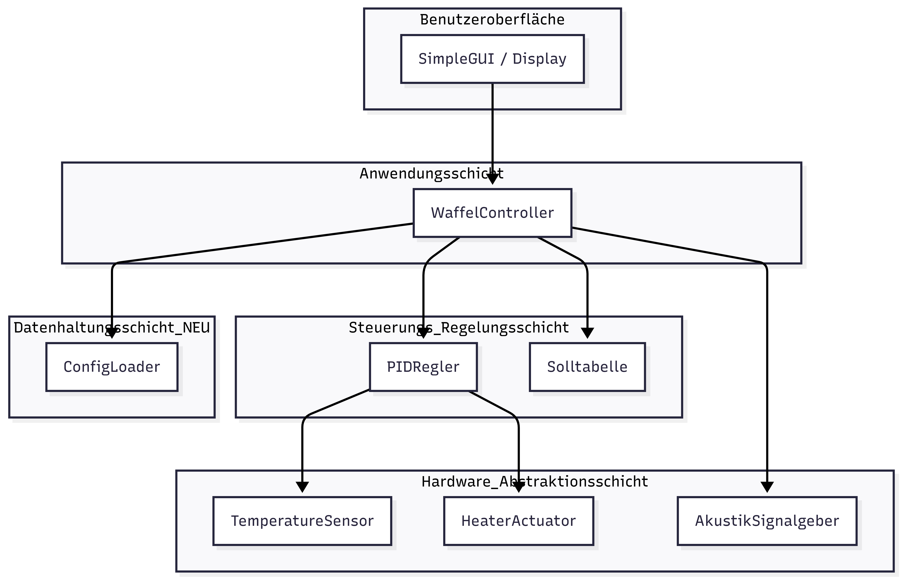

# Architektur (Sprint 2)

## Komponentendiagramm

Das Diagramm wurde in Sprint 2 um die **Datenhaltungsschicht** (für Konfigurationen) und die Komponente **AkustikSignalgeber** (in der Hardware-Schicht) erweitert.

- [ref. code in mermaid](../referenziert/design/komponentendiagram2.mmd)
- [ref. image in PNG](../referenziert/design/komponentendiagram2.png)

---

## Zuordnung der Requirements zu Komponenten

| **Komponente / Schicht** | **Zugehörige Requirements** |
| :--- | :--- |
| **Benutzeroberfläche (UI)** | Req. 1.1, 1.2, **4.1 (Fehleranzeige)** |
| **Anwendungsschicht (Application)** | Req. 1.1, 1.3, 3.1 |
| **Regelungsschicht (Core Logic)** | Req. 3.1, 3.3 |
| **Hardware-Abstraktion (HAL)** | Req. 2.2, **5.1 (Akustisches Signal)** |
| **Datenhaltungsschicht (Persistence)** | **Req. 1.4 (Config), 4.2 (Sprache)** |

---

## Verantwortlichkeiten der Komponenten

| **Komponente** | **Rolle** | **Verantwortlichkeiten** |
| :--- | :--- | :--- |
| **Benutzeroberfläche** | Präsentationsschicht | Anzeige des Betriebszustands, Anzeige von Fehlern (**FEHLER**), Eingabe über Tasten. |
| **Anwendungsschicht** | Steuerungslogik | `WaffelController`: Koordination des Gesamtablaufs. Lädt beim Start Konfigurationen und steuert den Backprozess. |
| **Regelungsschicht** | Regelungslogik | `PIDRegler`: Berechnung der Heizleistung basierend auf Sensorwerten. |
| **Hardware-Abstraktion** | Treiber / Interface | Verbindung zur Hardware: Temperatursensor, Heizelement und **NEU: AkustikSignalgeber (Buzzer)**. |
| **Datenhaltungsschicht** | Persistence | **NEU:** `ConfigLoader`: Laden von Konfigurationen und Sprachdateien (JSON) für die Flexibilität der Anwendung. |

---

## Schnittstellen (Aktualisiert für Sprint 2)

| Interface (Methode) | Sender (Aufrufer) | Empfänger (Klasse) | **Syntax (Kommunikationsart)** | **Semantik (Werte, Einheiten & Bereiche)** |
| :--- | :--- | :--- | :--- | :--- |
| **`laod_lang()`** | `WaffelController` | `ConfigLoader` | Synchroner Funktionsaufruf | **Input:** `lang: str` (z.B. "DE"). **Output:** `dict` (Texte für GUI). |
| **`piep()`** | `WaffelController` | `AkustikSignalgeber` | Synchroner Funktionsaufruf | **Input:** `anzahl: int` (Anzahl der Signale). Löst das Summen aus. |
| **`leseTemperatur()`** | `PIDRegler` | `TemperatureSensor` | Synchroner Funktionsaufruf | **Output:** `float` (Aktuelle Temperatur in **°C**). |
| **`calculateHeatingPower()`** | `WaffelController` | `PIDRegler` | Synchroner Funktionsaufruf | **Input:** `ist: float`. **Output:** `float` (Stellgröße **0.0 - 1.0**). |
| **`zeigeZustand()`** | `WaffelController` | `SimpleGUI` | GUI-Update (Tkinter) | **Input:** `text: str` (Der anzuzeigende Text, z.B. aus Config). |
| **`verarbeiteEingabe()`** | `ButtonInput` | `WaffelController` | Event / Callback | **Input:** `grad: int` (Bereich **1 bis 5**). |