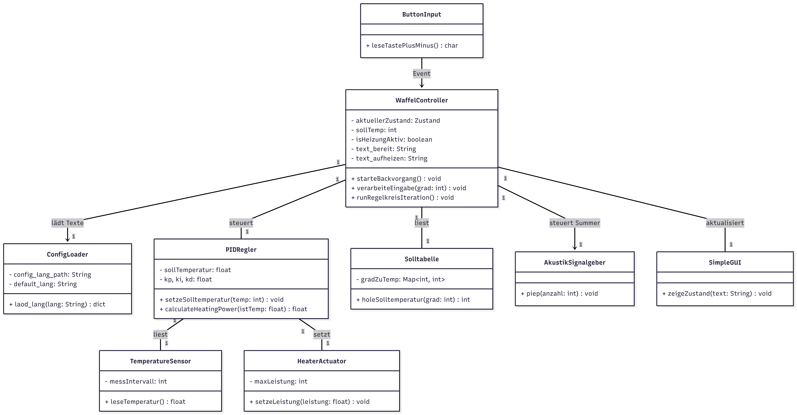
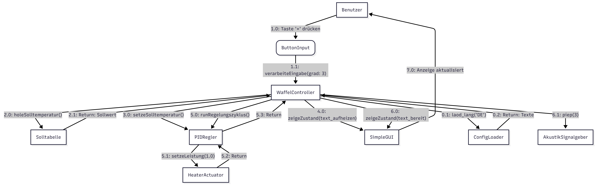

# Design (Sprint 2)

## Klassendiagramm

Das vorliegende Klassendiagramm stellt die erweiterte Struktur für **Sprint 2** dar. Es baut auf dem Design von Sprint 1 auf und integriert die neuen Anforderungen bezüglich **Datenhaltung** (Konfiguration/Sprache) und **akustischem Feedback**.

**Wichtige Änderungen in Sprint 2:**
* **Neue Klasse `ConfigLoader`:** Verantwortlich für das Laden von Texten aus JSON-Dateien (Datenhaltungsschicht).
* **Neue Klasse `AkustikSignalgeber`:** Repräsentiert den Summer/Buzzer in der Hardware-Schicht.
* **Erweiterung `WaffelController`:** Der Controller besitzt nun Referenzen auf diese neuen Komponenten und nutzt sie zur Laufzeit.

- [ref. code in mermaid](../referenziert/design/klassendiagram_2.mmd)
- [ref. image in PNG](../referenziert/design/klassendiagram_2.png)

## Sequenzdiagramm

Das Sequenzdiagramm für Sprint 2 visualisiert den Ablauf am **Ende des Backvorgangs**. Es zeigt detailliert, wie der `WaffelController` nach Erreichen der Zieltemperatur das **akustische Signal** auslöst und den Status auf der GUI aktualisiert (unter Verwendung der geladenen Konfigurationstexte).

- [ref. code in mermaid](../referenziert/design/Sequenzdiagramm_2.mmd)
- [ref. image in PNG](../referenziert/design/Sequenzdiagramm_2.png)

## Kommunikationsdiagramm

Das Kommunikationsdiagramm verdeutlicht die Interaktion und Nachrichtenflüsse zwischen dem zentralen `WaffelController` und den neuen Peripherie-Komponenten. Es zeigt, wie der Controller beim Start die **Konfiguration anfordert** (1.x) und beim Ereignis "Fertig" den **Buzzer ansteuert** (5.x).

- [ref. code in mermaid](../referenziert/design/Kommunikationsdiagramm_2.mmd)
- [ref. image in PNG](../referenziert/design/Kommunikationsdiagramm_2.png)
